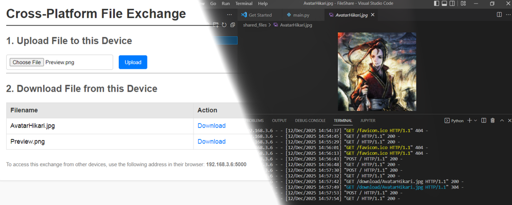
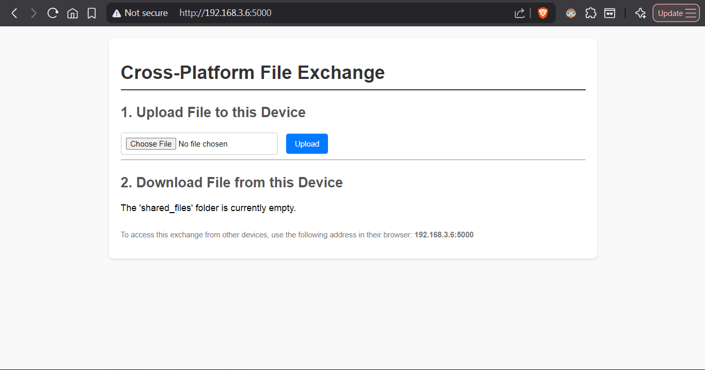
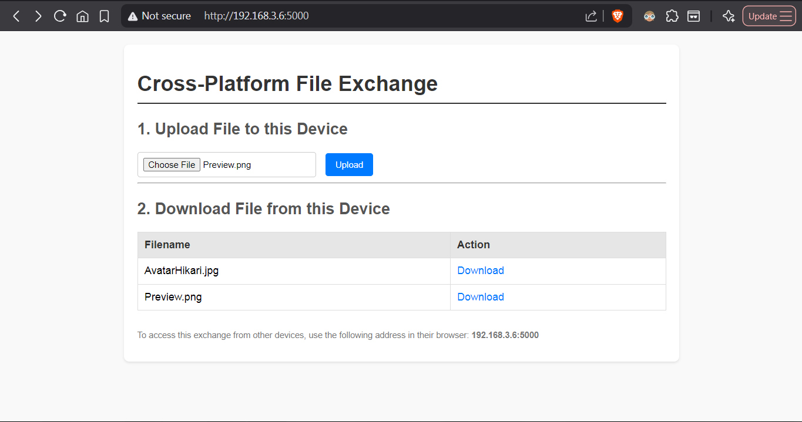
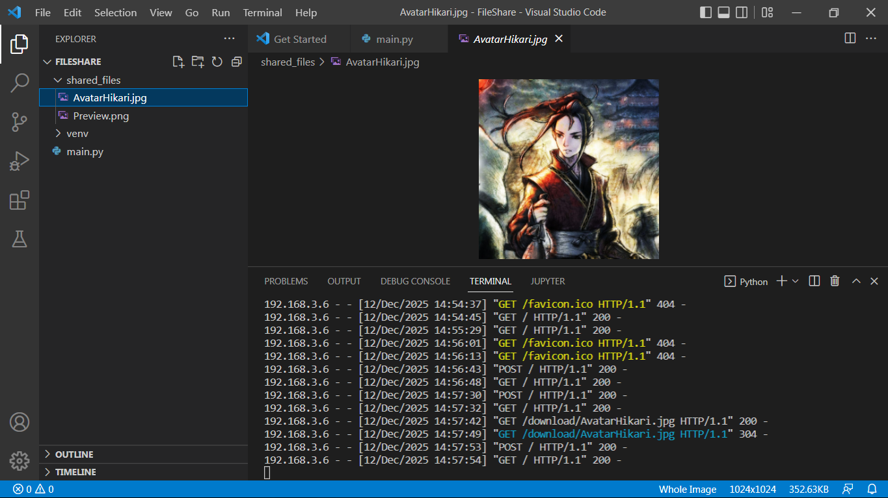
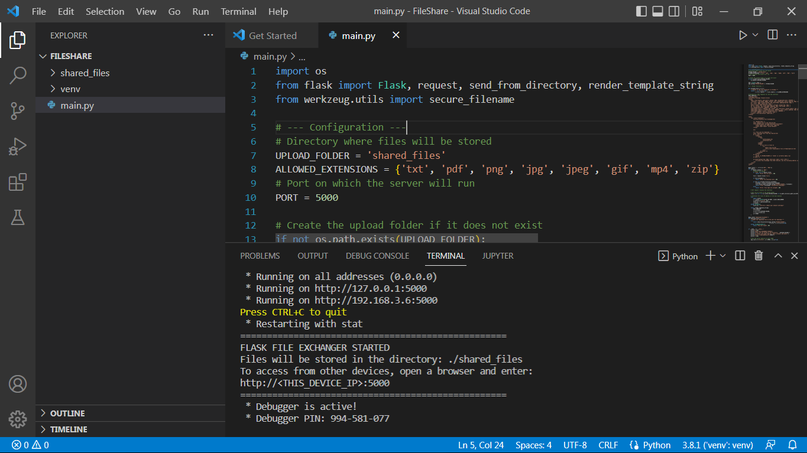

# File Share by EnG
**The simplest, fastest, and most minimalistic file-sharing utility**

[](https://www.python.org/)
[](https://flask.palletsprojects.com/)
[](https://opensource.org/licenses/MIT)



## 🌟 What is File Share?
**File Share by EnG** is an **open-source**, **peer-to-peer (P2P)** file-sharing tool designed for simplicity and speed. Built with Python and Flask, it allows you to transfer files **instantly** between any devices on the same local network—no cloud, no accounts, just drag-and-drop.

### Key Features:
✅ **Zero setup** – Run the executable and start sharing.
✅ **Cross-device** – Works on Windows, macOS, and Linux (via Python).
✅ **Lightweight** – Minimal codebase, no bloat.
✅ **Open-source** – Free to use, modify, and distribute.

---

## 🚀 How to Use
### Option 1: Download Pre-Built Executable (Windows)
1. Go to the **[Releases](https://github.com/EmberNoGlow/FileSharebyEnG/releases)** tab.
2. Download `FileSharebyEnG.exe`.
3. Run the executable.

### Option 2: Run from Source (Any Platform)
1. Clone the repository or download the source code:
   ```bash
   git clone https://github.com/EmberNoGlow/FileSharebyEnG.git
   cd fileshare
   ```
2. Install dependencies:
   ```bash
   pip install flask
   ```
3. Run the script:
   ```bash
   python main.py
   ```

### Sharing Files
1. On the **host device**, run File Share. Note the displayed IP address (e.g., `http://192.168.3.6:5000`).
2. On the **receiving device**, open a browser and enter the host’s IP address.
3. **Drag and drop** files into the browser **or** place them in the `shared_files` folder (created automatically).
4. Download files from the browser on the receiving device.

⚠️ **Note**: Both devices must be on the **same local network**.

---

## 🔧 Compile from Source
### Windows (`.exe`)
1. Install PyInstaller:
   ```powershell
   pip install pyinstaller
   ```
2. Compile:
   ```powershell
   pyinstaller --onefile --name="FileSharebyEnG" --icon="app.ico" main.py
   ```
   Or use the `.spec` file:
   ```powershell
   pyinstaller FileSharebyEnG.spec
   ```

### macOS/Linux
For other platforms, run the Python script directly or compile using PyInstaller (contributions welcome!).

---

## ⚯ Security & Privacy
- **Local-only**: Files never leave your network.
- **No tracking**: No analytics or telemetry.
- **Temporary**: Files are only accessible while the host is running.
- **Recommendation**: Use on **trusted networks** only (e.g., home/office).

---

## 🔨 Contributing
Found a bug? Want to add features? Contributions are welcome!
1. Open an **[Issue](https://github.com/EmberNoGlow/FileSharebyEnG/issues)**.
2. Submit a **Pull Request** (PR).

### How to Help:
- Compile for macOS/Linux and share the binaries.
- Improve the UI/UX.
- Add support for larger files or encryption.

---

## 🎨 Screenshots
|         |         |
|:-------:|:-------:|
|  |  |
|  |  |
---

## 📜 License
This project is licensed under the **MIT License** – see [LICENSE](LICENSE) for details.

---

## 💙 Support the Project
- **Star** the repository to help others discover it.
- Share with friends or colleagues who need a simple file-sharing tool.
- Check out my other projects on [GitHub](https://github.com/EmberNoGlow).
---
Article on [Dev.to](https://dev.to/embernoglow/file-sharing-tired-of-slow-transfers-heres-the-easiest-and-fastest-utility-to-share-files-1on2)
